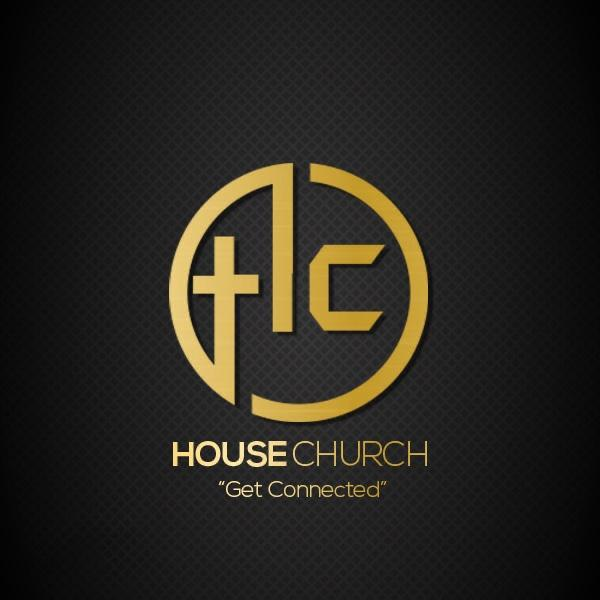

# House Church App

House Church App is used to gather world wide Christians
 to share the Gospel. 
 Developed using React Frontend Interface.

Logo of House Church App

🏃‍♂️ Local Installation
1. Drop a ⭐ on the Github Repository.
2. Clone the Repo by going to your local Git Client and 
pushing in the command:
https://github.com/Ida-technology-Ltd/housechurch
3. Install the Node Modules:
npm install
4. At last, push in the command which will kickstart the 
application on Local Host:
npm start
